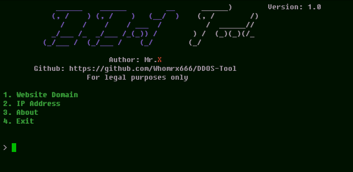

# 👾 DDOS Tool 👾  

<p align="left" display="inline-block">
<p>



## What is DDOS-Tool?
```diff
! This is the best tool for DDoS attacks on github.
```

 _DDOS-Tool_ is a tool for DDoS attacks. You can test networks/servers/any other devices with it.

## How it Works? 
 It sends continuous packets to the target. This attack is known as _DDoS attack_.

## What is DDoS Attack?
 In a _Distributed Denial-of-Service_ attack (_DDoS attack_), the incoming traffic flooding the victim originates. This effectively makes it impossible to connect to an other device.

## Supported Devices:
 This program is supported in all operating system like _Linux_, _Windows_, _MacOs_ and _Termux_. The Code is written in _python3_, so Don't worry it works well without any bugs.

## Installing (_Windows/Linux/MacOs/Termux_):
```
apt-get update -y
apt-get install git
git clone https://github.com/Whomrx666/DDOS-Tool.git
cd DDOS-Tool
bash setup.sh
python3 DDOS-Tool.py
```

## One line Installation:
```
apt-get update -y && apt-get install git && git clone https://github.com/Whomrx666/DDOS-Tool.git && cd DDOS-Tool && bash setup.sh && python3 DDOS-Tool.py
```

## Errors? Troubleshooting is here:
 If it's about libraries, just write these strings:
```
pip install tqdm
pip install pyfiglet
```

## Disclaimer

This tool must be used in educational purposes only. Your decisions are not our responsibility.

## CONNECT WITH ME :

[](https://whomrxhackers.blogspot.com/)
[](https://twitter.com/whomrx666)
[](https://youtube.com/@whomrx666)
[](https://facebook.com/https://www.facebook.com/whomrx.666)
[](https://t.me/Whomr_X)
[](mailto:whomrx666@gmail.com)
[](https://www.tiktok.com/@whomr.x)

**If you want to donate, click on the button**
<a href="https://saweria.co/whomrx"></a>

### Visitors :

##
All material in this repository is in the public domain.
